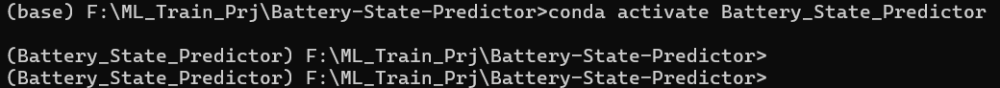
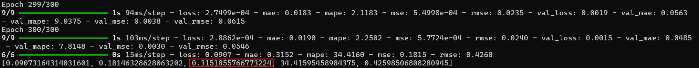
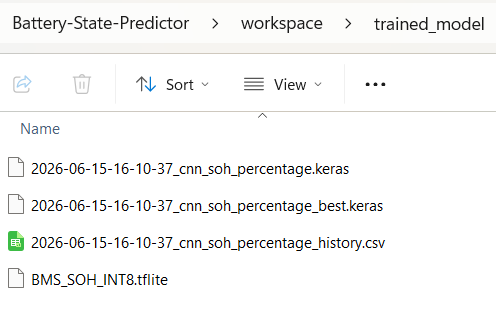
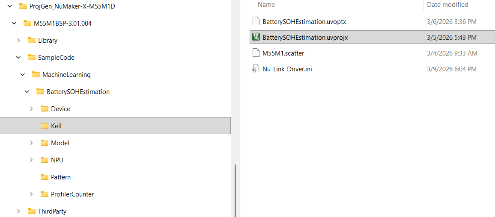
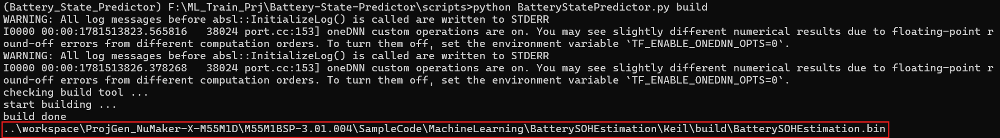
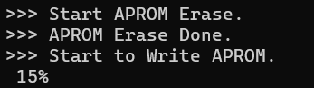
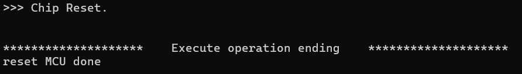
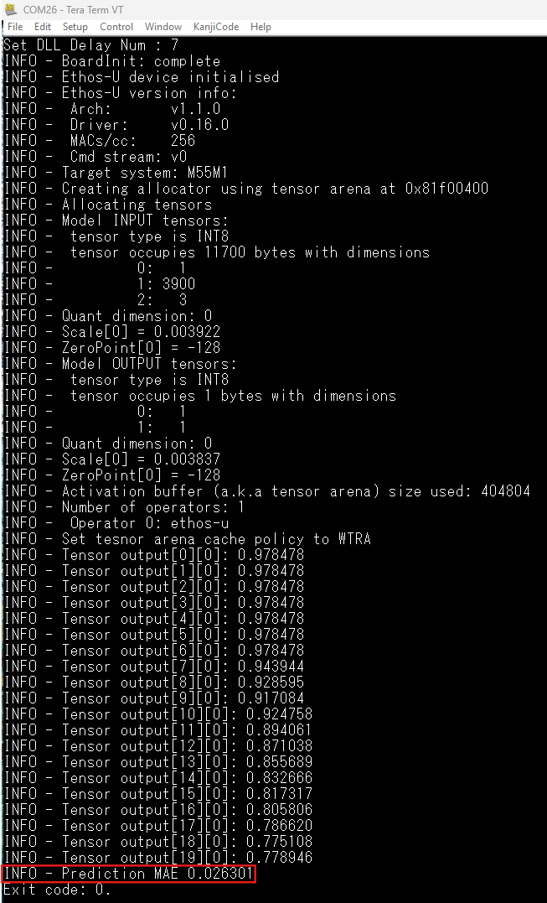

# Battery State Predictor
An end-to-end machine learning framework designed for training, generating, and deploying Battery State of Charge (SOC) and State of Health (SOH) estimation models to embedded devices. This project provides a streamlined pipeline from data processing and model training (using Keras/TensorFlow) to automated C++ code generation and hardware flashing for the Nuvoton NuMaker-X-M55M1D board equipped with the M55M1 Ethos-U NPU.

## Key Features
* Deep Learning Models: Purpose-built neural network architectures for predicting battery SOC and SOH.
* Data Processing: Built-in utilities to ingest and process the NASA Randomized Battery Usage Dataset (.mat to CSV conversion).
* Automated Code Generation: Uses Jinja2 templates to automatically generate `main.cpp` and `NNModel.cpp/hpp` integration layers for the specific embedded target.
* TFLite Integration: Custom FlatBuffer parsers to handle TensorFlow Lite model ingestion and preparation for microcontrollers.
* End-to-End CLI Pipeline: Scripts to handle the entire lifecycle: creating the model, generating the embedded Keil project, building the binaries, and flashing them to the M55M1 MCU.

## Repository Structure
```
Battery-State-Predictor/
├── csv_data/                        # Battery dataset (csv format)
├── NuLink Command Tool/             # Target firmware flashing tool for NuMicro MCUs
├── scripts/
│   ├── BatteryStatePredictor.py     # Main CLI entry point for the prediction pipeline
│   ├── config.yaml                  # Global configuration parameters (auto generation)
│   ├── model_create.py              # Triggers the SOC/SOH model training processes
│   ├── project_generate.py          # Generates MCU project files using TFLite models
│   ├── project_build.py             # Automates the Keil project build process 
│   ├── project_deploy.py            # Prepares the built binaries for deployment
│   ├── project_flash.py             # Flashes the final firmware to the hardware target
│   │
│   ├── model/                       # ML Architecture & Training
│   │   ├── SOC_Model.py             # State of Charge model definition and training
│   │   ├── SOH_Model.py             # State of Health model definition and training
│   │   ├── NASA_mat_csv.py          # NASA dataset conversion script
│   │   └── data_processing/         # Data normalization and feature extraction
│   │
│   ├── templates/                   # Embedded Firmware Templates
│   │   └── M55M1/NuMaker-X-M55M1D/  # Target specific base projects (Keil uvprojx)
│   │       ├── soc_template/        # SOC base template (Ethos-U NPU config, HyperRAM)
│   │       └── soh_template/        # SOH base template (Ethos-U NPU config, PMU counters)
│   │
│   ├── soc_codegen/                 # SOC Code Generators (Python + Jinja2)
│   ├── soh_codegen/                 # SOH Code Generators (Python + Jinja2)
│   └── tflite/                      # TFLite FlatBuffer schema parsers
├── tflite2cpp/                      # Conversion tool for TFLite model to CPP header file
└── vela/                            # Model compiler for Ethos-U NPU

```

## Prerequisites
To run the pipeline smoothly on a Windows environment, ensure the following are installed:
* Python 3.10+ (with numpy, tensorflow/keras, jinja2, and pyyaml)
* [Keil MDK](https://www.nuvoton.com/tool-and-software/ide-and-compiler/keil-download/) (uVision 5) for compiling the M55M1 .uvprojx projects.
* [Nuvoton Nu-Link Driver](https://www.nuvoton.com/tool-and-software/ide-and-compiler/index.html) for flashing the firmware to the NuMaker board.
* Miniforge

## Miniforge installation
To install Miniforge, download the installer for windows system from the [Conda-Forge Download Page](https://conda-forge.org/download/) or the [GitHub Releases Page](https://github.com/conda-forge/miniforge/releases).

1. Download the latest Windows executable (usually Miniforge3-Windows-x86_64.exe) from the Conda-Forge Download Page.
2. Double-click the `.exe` file to launch the installation wizard.
3. Follow the prompts. It is highly recommended to uncheck "Register Miniforge3 Python as my default Python" if you already have another Python installation on your system.
4. Once completed, use the "Miniforge Prompt" from your start menu to access the conda and mamba tools.
5. To ensure a consistent Python environment, it is recommended to create a Python environment from the `Conda environment YAML` file on Miniforge.
```
conda env create -f environment.yml
conda activate Battery_State_Predictor
```

## Usage
The repository uses a modular script system to manage the lifecycle of the battery state estimator. While full command-line arguments example can be found in `_command_usage.txt`, the general pipeline follows these steps:
1. Data Preparation and Model Training:  
Specify workspace, NASA dataset path and .csv files (e.g., B0005). The system will convert them and train the networks.
    * Parameter
        * workspace: Output directory path for model and target project generation.
        * model_type: Specify the model type
            * soc
            * soh
        * dataset_folder: Specify the dataset folder
        * train_file: Specify training dataset(csv) files
        * test_file: Specify test dataset(csv) file
        * epochs [option]: Training epochs

```
cd scripts
```
```
python BatteryStatePredictor.py create --workspace ..\workspace --model_type soh --train_file B0005 B0006 --test_file B0005 --dataset_folder ..\csv_data --epochs 300
```
2. Code Generation:  
Once the `.tflite` model is generated, run the project generator. This invokes the Jinja2 templates in soc_codegen or soh_codegen to bind the TFLite operations into the embedded C++ wrappers (`NNModel.cpp`).
    * Parameter
        * model_arena_size [option]: Specify the size of arena cache memory in bytes
```
python BatteryStatePredictor.py generate
```
3. Building the Firmware:  
Invoke the build script, which interfaces with Keil uVision in the background to compile the M55M1 firmware alongside the Ethos-U driver stack.
    * Parameter
        * uv4_tool [option]: UV4.exe path
```
python BatteryStatePredictor.py build
```
4. Flashing to Hardware:  
Connect the NuMaker-X-M55M1D board via USB and flash the compiled binary directly to the device.
    * Parameter
        * binary_file [option]: Specify the binary file of project
```
python BatteryStatePredictor.py flash
```
## READMEs
* [Dataset Description](scripts/model/data/README.md)
* [Model Architecture](scripts/model/README.md)

## Workflow
The following steps explain how to build the SOH/SOC models step by step and deploy them to the M55M1.
1. Clone the entire Battery State Predictor project with `git clone`, then follow the [Miniforge installation](#miniforge-installation) section above to create and activate the Python environment.



2. Prepare the NASA-format dataset containing battery current, voltage, and temperature data, then use the `create` command to train the model. Refer to step 1 in [Usage](#usage). Model training may take some time, so please wait patiently.

   After training completes, you can review the result shown below and check the final MAE (Mean Absolute Error) for test dataset. The trained model will be placed in your workspace folder.






3. Once the model has been created, use the `generate` command to produce the Keil project for SOH/SOC model inference. Refer to step 2 in [Usage](#usage). The generated project will be placed under the `workspace` directory you specified. You can open the project .uvprojx file directly in Keil to build and flash it, or use the following commands to build and flash it.



4. Use the `build` command to compile the Keil project for SOH/SOC model inference. Refer to step 3 in [Usage](#usage).



5. Connect the PC and Nu-Link2 using a USB cable, then use the `flash` command to program the compiled binary file. Refer to step 4 in [Usage](#usage).




## Result
Because the NuMaker-X-M55M1D does not include battery current, voltage, or temperature sensing modules, the project uses part of the dataset to infer the SOH/SOC estimation values and then calculates the MAE against the actual values in the dataset. A smaller MAE is better. The inferred result should be close to the values described in [Model Architecture](scripts/model/README.md) (SOH: 0.0422(4.22%), SOC: 0.0218(2.18%)).

Open a terminal program such as TeraTerm, and set the USB serial port to 115200:8-n-1. The result is shown below.



## Enable Windows Long Paths
If you frequently encounter "Path too long" errors when downloading or extracting files, you can increase the system limit beyond 260 characters using the Registry.
1. Press `Win` + `R`, type `regedit`, and hit Enter.
2. Navigate to: `HKEY_LOCAL_MACHINE\SYSTEM\CurrentControlSet\Control\FileSystem`
3. Find the `LongPathsEnabled` value. (If it doesn't exist, right-click inside the right pane, select New > DWORD (32-bit) Value, and name it `LongPathsEnabled`).
4. Double-click it and set the Value data to `1`.
5. Click OK and restart your PC.