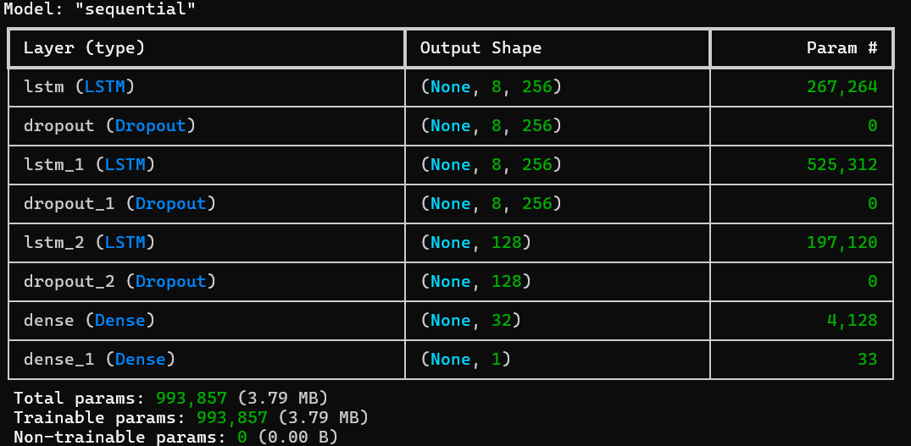
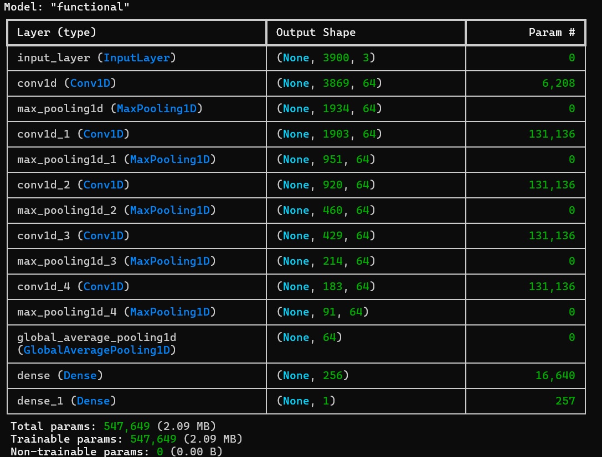
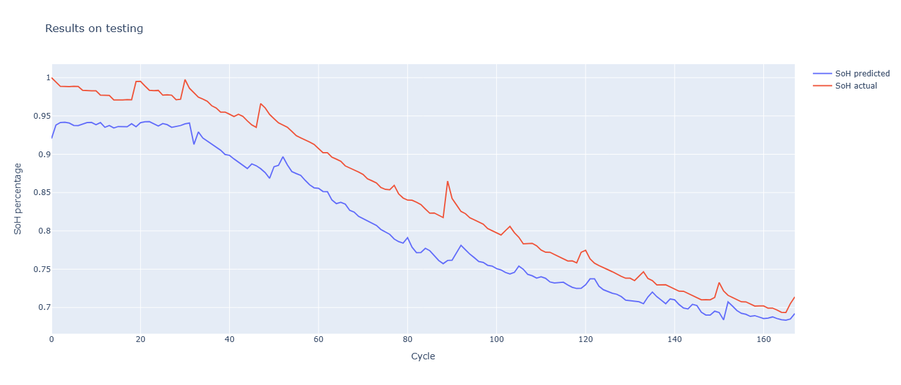
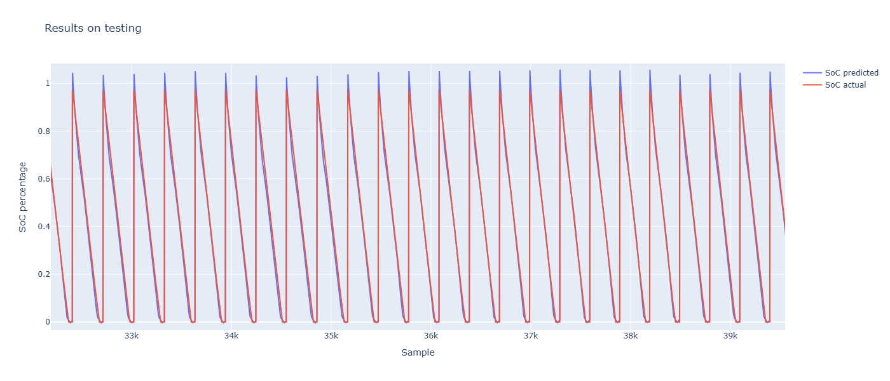

# BMS Battery State Estimation

This project is a deep learning-based Battery Management System (BMS) model architecture designed to accurately predict the State of Health (SOH) and State of Charge (SOC) of lithium-ion batteries using charge and discharge data.

## Project Structure

* `SOC_Model.py`: Training script for SOC prediction using an LSTM architecture.
* `SOH_Model.py`: Training script for SOH prediction using a CNN architecture.
* `data_processing/`:
    * `data`: NASA dataset
    * `NASA_data.py`: Data loading and cleaning tool (supports the NASA battery dataset).
    * `model_data_handler.py`: Data normalization and model input formatting.

## Core Features

### 1. Data Preprocessing
* **Data Cleaning**: Automatically filters out records with anomalous voltages (< 0.1V or > 5.0V).
* **Feature Scaling**: Uses `MinMaxScaler` to scale voltage, current, and temperature between 0 and 1.
* **Sequence Generation**: Provides the `create_sequence_data` function to convert time-series data into a 3D tensor format suitable for LSTM processing.

### 2. Model Architecture
* **SOC Prediction (LSTM)**:
    * Multi-layer LSTM structure (256 -> 256 -> 128 units).
    * Includes Dropout layers to prevent overfitting.
    * Uses Huber Loss as the loss function for better robustness against outliers.


* **SOH Prediction (CNN)**:
    * Four `Conv1D` layers combined with `MaxPooling1D` to extract cycle features.
    * Fully connected layer (Dense) for the final regression prediction.



## How to Use

### Requirements
* Python v3.10
* TensorFlow v2.20.0
* Keras v3.12.1
* NumPy v2.2.6
* Pandas v2.3.3
* Scikit-learn v1.7.2
* Plotly (for result visualization) v6.5.2

### Dataset
1. Download NASA dataset from https://github.com/natskiu/Nasa-Battery/tree/main/Data to `./data` folder
2. Modify `NASA_mat_csv.py` mat_files[ ]
```
mat_files = ['B0005', 'B0006', 'B0007'] #list of .mat files to be converted to csv files
```
3. Execute `python NASA_mat_csv.py`. It will convert mat to csv file format and output to  `./csv_data` folder.  
### Execution
Predict SOH:  
Using `BatteryStatePridictor.py` create command for SOH model
```bash
python BatteryStatePridictor.py create ... --model_type soh ...
```

Predict SOC:  
Using `BatteryStatePridictor.py` create command for SOC model
```bash
python BatteryStatePridictor.py create ... --model_type soc ...
```
## Result
### SOH 
MAE (Mean Absolute Error): 0.0422 @ epoch 300 

### SOC
MAE: 0.0218 @ epoch 10



## Reference Paper

*Li-Ion Batteries State-of-Charge Estimation Using Deep LSTM at Various Battery Specifications and Discharge Cycles* [[DOI](https://doi.org/10.1145/3462203.3475878)]

```
@inproceedings{10.1145/3462203.3475878,
author = {Wong, Kei Long and Bosello, Michael and Tse, Rita and Falcomer, Carlo and Rossi, Claudio and Pau, Giovanni},
title = {Li-Ion Batteries State-of-Charge Estimation Using Deep LSTM at Various Battery Specifications and Discharge Cycles},
year = {2021},
isbn = {9781450384780},
publisher = {Association for Computing Machinery},
address = {New York, NY, USA},
url = {https://doi.org/10.1145/3462203.3475878},
doi = {10.1145/3462203.3475878},
booktitle = {Proceedings of the Conference on Information Technology for Social Good},
pages = {85–90},
numpages = {6},
location = {Roma, Italy},
series = {GoodIT '21}
}
```